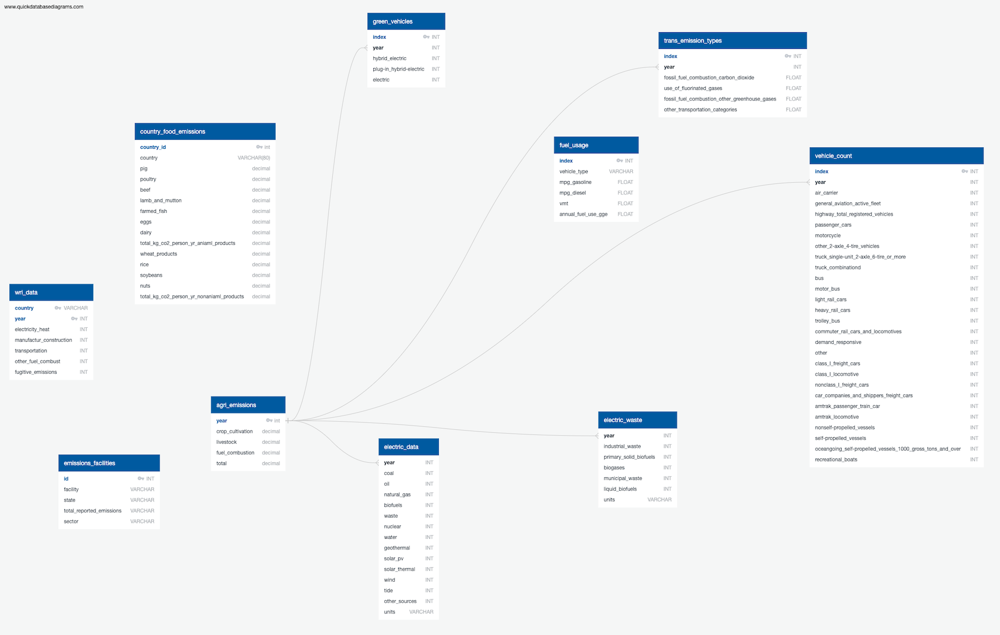

## **Data Cleaning Explanation:**
The tables gathered for this project focus on how different sectors play a part in greenhouse gasemissions.

* The tables, electric_data and electric_waste, were extracted as csv files from the International Energy Agency's (IEA) website. The only transformation that they needed were their column names were changed to be in proper PostgreSQL format.
* The wri_data table was also extracted as a csv files from the World Resources Institute's website, and it was also pretty organized. The column names were changed for PostgreSQL use, and there was also a significant amount of NaNs that needed to be removed from the 1970s.
* The agri_emissions table came as a csv file from the EPA’s website. Once extracted, the columns and rows had to be switched (using .transpose()) so that all the years were in a single column instead of the column headers. The top row of the dataframe then had to be pushed up to become the column headers. The index then had to be reset so that the years were the first column instead of the index. Lastly, the column headers had to be renamed to fit PostgreSQL’s naming format.
* The country_food_emissions table had to be scraped from a web page using Splinter and Beautiful Soup. Because the table on the webpage had icons instead of words as column headers, the dataframe had unnamed headers, and every column had to be renamed. Then only the data for food that was “actually consumed” and the totals were kept by deleting data related to “supplied for consumption”. An issue this dataframe initially had was that there were 3 levels of column headers, but to import into PostgreSQL, there can only be one. Therefore, two levels had to be removed and the remaining level had to be renamed more appropriately.
* The fuel_usage table was built from a csv base file and required minimal cleaning. A source column was dropped as it was unnecessary for this current project. Otherwise the only transformations that were made were renaming columns to match Postgres styling, and column data types were changed to ensure all numeric values were integers or floats. 
* The trans_emission_types was built from a csv base file and was first filtered to a select range of years. Columns were renamed to match Postgres styling, the table was transposed to allow years to act as a column and not rows, and the year column was reformatted into an integer data type.
* The green_vehicles table was built from a csv base file. All year tags had to be renamed to remove extra text and missing data had to be replaced with zero values rather than the letter "Z". The table was transposed to make “year” a column and all column names were restyled for Postgres. The entire table was also recast as int64 to allow for use in queries.
* The vehicle_count table was built from a csv base file and required more involved cleaning. The data was filtered to a select range of years and unnecessary columns were dropped along with all rows containing NaN values, as they were populated from internal header rows in the original file. All rows with missing data were also dropped and the table was transposed to make “year” into a column and not row. Column names had to be changed to match Postgres styling and the entire table was recast as int64.
* The emissions_facilities table was built by scraping the EPA “FLIGHT” website using Beautiful Soup and Splinter. To extract the needed data from the website, Splinter was used to exit out of the inital pop up when you first enter the website. A for loop utilizing Splinter and Pandas was then use to click on states in a drop down menu and add their data to one large dataframe. The transfomration step involved dropping a repeated index columns and a column with unneeded information, and renaming columns to match Postgres styling.

## **Table descriptions:**
1. electric_data
    1. This table contains world-wide data on electricity generation (in gigawatt hours) by source from 1990-2017.
1. electric_waste
    1. This table contains world-wide data on electricity generation from biofuels and waste (in gigawatt hours) by source from 1990-2017.
1. wri_data
    1. This table contains yearly data on CO2 emissions (in metric tons) by sector from 1980-2012 from 186 countries.
1. agri_emissions
    1. This table contains the emissions (in metric tons of carbon dioxide equivalents) produced in crop cultivation, livestock, fuel combustion, and their total in the U.S. from 1990-2018.
1. country_food_emissions
    1. This table contains the kg CO2/person/year for several animal and non-animal products, along with the totals, for 130 countries from 2018.
1. green_vehicles
    1. This table contains the total count for hybrid-electric, plug-in hybrid electric, and electric vehicles registered in the United States annually between 2000-2018.
1. fuel_usage
    1. This table contains annual fuel use data for various vehicle types and is intended as a reference for calculating annual total fuel use in concert with other tables. 
1. trans_emission_types
    1. This table contains the annual emission data of the transportation sector of the United States broken down by types of emission, covering 2000-2006.
1. vehicle_count
    1. This table contains a count of the number of active/registered vehicles of various classes in the United States annually between 2000-2006.
1. emissions_facilities
    1. This table contains the data on greenhouse gas emissions (in million metric tons of CO2) by industry in the United States for the year 2018.
    
**For example queries please see the "query.sql" file.**

## **How to re-create the relational PostgreSQL database:**
1. Open PGAdmin
1. Create a database nameed "emissions_db"
1. Copy and paste the schema in the file, "schema.sql" into your query editor and run it.
1. Save the files "final_combined_notebooks.ipynb" and "config.py", and the folder "resources" with all its contents to a folder on your conmputer.
1. Change your config.py file so it contains your PGAdmin passsword.
1. Open your terminal.
1. cd into the folder you saved the files in.
1. Open Jupyter notebook by running the command "jupyter notebook".
1. Open the file "final_combined_notebooks.ipynb".
1. Run all of the cells of the notebook.
1. Go to your PGAdmind window.
1. Copy and paste the queries from the file, "queries.sql" into your query editor and run them one at a time.

## **All tables and relationships in the database:**

## **Links to websites were data was extracted from:**
1. [electric_data](https://www.iea.org/data-and-statistics?country=WORLD&fuel=Energy%20supply&indicator=Electricity%20generation%20by%20source)
1. [electric_waste](https://www.iea.org/data-and-statistics?country=WORLD&fuel=Energy%20supply&indicator=Electricity%20generation%20from%20biofuels%20and%20waste%20by%20source)
1. [wri_data](https://datasets.wri.org/dataset/cait-country)
1. [agri_emissions](https://cfpub.epa.gov/ghgdata/inventoryexplorer/#agriculture/allgas/source/all)
1. [country_food_emissions](https://www.nu3.de/blogs/nutrition/food-carbon-footprint-index-2018)
1. [green_vehicles](https://www.bts.gov/content/gasoline-hybrid-and-electric-vehicle-sales)
1. [fuel_usage](https://afdc.energy.gov/data/10308)
1. [trans_emission_types](https://cfpub.epa.gov/ghgdata/inventoryexplorer/#allsectors/allgas/econsect/all)
1. [vehicle_count](https://www.bts.gov/content/number-us-aircraft-vehicles-vessels-and-other-conveyances)
1. [emissions_facilities](http://ghgdata.epa.gov/ghgp/main.do#)
